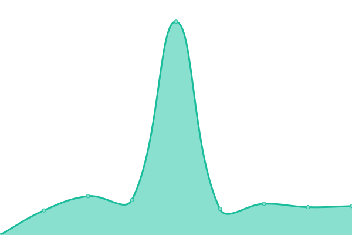

# [📈 Live Status](https://wuan.github.io/bo-upptime/): <!--live status--> **🟩 All systems operational**

This repository contains the open-source uptime monitor and status page for [Andreas Würl](https://wuerl.net), powered by [Upptime](https://github.com/upptime/upptime).

With [Upptime](https://upptime.js.org), you can get your own unlimited and free uptime monitor and status page, powered entirely by a GitHub repository. We use [Issues](https://github.com/wuan/upptime/issues) as incident reports, [Actions](https://github.com/wuan/upptime/actions) as uptime monitors, and [Pages](https://wuan.github.io/bo-upptime/) for the status page.

<!--start: status pages-->
<!-- This summary is generated by Upptime (https://github.com/upptime/upptime) -->
<!-- Do not edit this manually, your changes will be overwritten -->
<!-- prettier-ignore -->
| URL | Status | History | Response Time | Uptime |
| --- | ------ | ------- | ------------- | ------ |
|  [Website](https://blitzortung.tryb.de) | 🟩 Up | [website.yml](https://github.com/wuan/bo-upptime/commits/HEAD/history/website.yml) | 

 642ms
     
 | 

<a href="https://wuan.github.io/bo-upptime/history/website">100.00%</a>
    

|  [BO-Service 1](http://tryb.de) | 🟩 Up | [bo-service-1.yml](https://github.com/wuan/bo-upptime/commits/HEAD/history/bo-service-1.yml) | 

 261ms
     
 | 

<a href="https://wuan.github.io/bo-upptime/history/bo-service-1">97.84%</a>
    

|  [BO-Service 1 Metrics](https://metrics.tryb.de) | 🟩 Up | [bo-service-1-metrics.yml](https://github.com/wuan/bo-upptime/commits/HEAD/history/bo-service-1-metrics.yml) | 

 855ms
     
 | 

<a href="https://wuan.github.io/bo-upptime/history/bo-service-1-metrics">99.12%</a>
    

|  [BO-Service 2](http://raijin.tryb.de) | 🟩 Up | [bo-service-2.yml](https://github.com/wuan/bo-upptime/commits/HEAD/history/bo-service-2.yml) | 

 441ms
     
 | 

<a href="https://wuan.github.io/bo-upptime/history/bo-service-2">100.00%</a>
    

|  [BO-Service 2 Metrics](https://raijin.tryb.de) | 🟩 Up | [bo-service-2-metrics.yml](https://github.com/wuan/bo-upptime/commits/HEAD/history/bo-service-2-metrics.yml) | 

 646ms
     
 | 

<a href="https://wuan.github.io/bo-upptime/history/bo-service-2-metrics">100.00%</a>
    

<!--end: status pages-->

[**Visit our status website →**](https://wuan.github.io/bo-upptime/)

## 📄 License

- Powered by: [Upptime](https://github.com/upptime/upptime)
- Code: [MIT](./LICENSE) © [Anand Chowdhary](https://anandchowdhary.com), supported by [Pabio](https://pabio.com)
- Data in the `./history` directory: [Open Database License](https://opendatacommons.org/licenses/odbl/1-0/)
